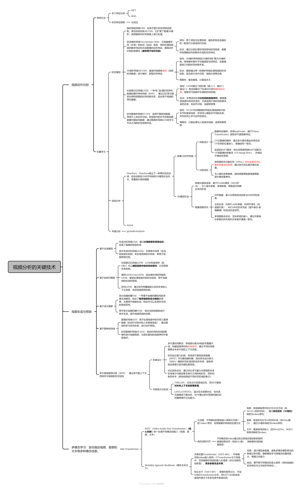
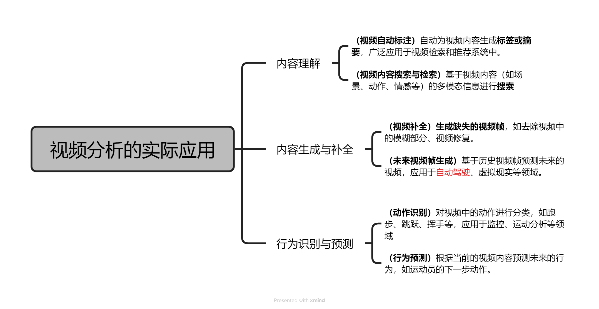

# 文献综述

## 一. 摘要

非结构化数据（如图像、视频、音频和文本）占全球数据总量的80%以上，其处理与分析已成为计算机视觉、自然语言处理和多模态学习的核心研究方向。本文综述了2014-2024以来在非结构化数据处理，尤其是视频分析领域的主要研究方法、技术进展及其应用。通过对多篇代表性文献的分析，本文总结了当前研究的核心挑战、技术突破及未来研究方向，旨在初步了解非结构数据的大体研究进程并梳理相关思路，为研究者提供研究现状概览和启发。

## 二. 引言

非结构化数据占据了全球数据总量的80%以上，其多样性和复杂性为数据处理带来了巨大挑战。视频数据作为非结构化数据的重要组成部分，因其包含丰富的时空信息和多模态特征（如视觉、音频和文本），成为研究的热点。近年来，深度学习技术的快速发展推动了视频分析领域的显著进步，尤其是在动作识别、视频生成、多模态学习和长期预测等任务中。然而，现有方法仍面临诸多挑战，如数据标注成本高、模型泛化能力有限、计算复杂度高等问题。

本文基于20篇代表性文献，系统梳理了非结构化数据处理领域的研究现状，重点关注视频分析中的关键技术和方法，并探讨未来研究方向。笔者由于知识储备有限，经验较少，若其中有不准确的地方，还望指出。

## 三. 非结构化数据处理的挑战

非结构化数据的处理面临以下核心挑战

- 视频和图像数据的**高维度特性**导致特征提取和存储成本高昂。
- 底层特征与高层语义之间的映射关系复杂，难以通过传统方法建模。
- 视频数据中的时间动态性要求模型能够捕捉长短期依赖关系。
- 视频通常包含视觉、音频和文本信息，难以有效融合**多模态数据**。
- 监督学习方法依赖大量标注数据，而标注成本高昂且难以扩展。

## 四. 视频分析的关键技术与方法

### 1.视频动作识别

视频动作识别是视频分析的核心任务之一。Simonyan和Zisserman（2014）提出的**双流卷积网络（Two-Stream ConvNets）**通过分别建模**空间（外观）**和**时间（运动）**信息，显著提升了动作识别性能。后续研究（如Karpathy等，2014）进一步探索了大规模视频分类中的时空建模方法。然而，现有方法在处理**快速动作**和**长尾类别分布**时仍存在局限性（Wu等，2023）。

### 2.视频生成与预测

视频生成与预测任务旨在从现有视频数据中生成未来帧或预测长期活动。Vondrick等（2016）提出的**生成对抗网络（GAN）**通过分离前景和背景动态，实现了逼真的视频生成。Walker等（2017）则通过结合**变分自编码器（VAE）和GAN**，提出了**基于人体姿态**的视频预测方法，显著提升了预测精度。Tan等（2023）提出的**多尺度视频预训练（MVP）**方法通过自监督学习捕捉多尺度时间依赖关系，在长期活动预测任务中取得了显著性能提升。

### 3.多模态学习

多模态学习旨在融合视频、音频和文本等多种模态信息。Akbari等（2021）提出的VATT框架通过Transformer架构实现了**多模态自监督学习**，在视频动作识别和音频事件分类任务中取得了最先进的性能。Zhao等（2022）则提出了分层多模态Transformer，用于视频摘要生成任务，显著提升了摘要质量。

### 4.自监督学习

自监督学习通过利用未标注数据学习表征，减少对标注数据的依赖。Tan等（2023）的MVP方法和Lotter等（2017）的PredNet框架均展示了自监督学习在视频预测任务中的潜力。这些方法通过预测未来帧或学习内部表征，显著提升了模型的泛化能力。

## 五. 应用与实证分析

视频分析技术在多个领域展现了广泛的应用前景：

1.融资决策影响因素分析：Hu和Ma(2021)聚焦创业者在向投资者展示时，非内容因素对融资决策的影响，揭示了非内容因素在融资中的关键作用。

2.金融预测：Zeng等（2022）将视频预测技术应用于金融时间序列分析，通过将价格数据可视化为图像，实现了有效的价格演变预测。

3.体育分析：Wu等（2023）综述了视频动作识别技术在体育分析中的应用，如战术分析和比赛集锦生成。

4.社交媒体分析：Yang等（2023）提出了基于深度学习的算法，用于评估抖音网红视频广告的有效性，显著提升了销售预测精度。

## 六. 研究缺口与未来方向

- **自适应多尺度建模**：现有方法通常依赖固定时间窗口，难以适应不同动作的时间尺度变化。
- **跨域泛化能力有限**：当前模型在跨域数据（如从室内场景到户外场景）中的泛化能力有限。
- **计算效率**：Transformer等模型的计算复杂度较高，难以应用于实时场景。

## 七. 未来研究方向包括：

- 开发自适应多尺度建模方法，以更好地捕捉视频中的时间层次性。

- 探索跨域迁移学习和元学习技术，提升模型的泛化能力。

- 优化模型计算效率，如通过模型压缩和分布式训练。

- 研究多模态对齐和融合的新方法，如基于对比学习的多模态表征学习。

## 八. 结论
本文综述了非结构化数据处理，尤其是视频分析领域的研究现状，总结了当前的核心挑战、技术突破和应用场景。通过对多篇代表性文献的分析，本文指出了现有方法的局限性，并提出了未来研究方向。随着深度学习技术的不断发展，非结构化数据处理领域仍具有广阔的研究空间和应用潜力。

## 所述文献

Simonyan and Zisserman - 2014 - Two-Stream Convolutional Networks for Action Recognition in Videos
Karpathy  - 2014 - Large-Scale Video Classification with Convolutional Neural Networks
Venugopalan - 2015 - Sequence to Sequence - Video to Text
Vondrick_Pirsiavash_Torralba-2016-Generating Videos with Scene Dynamics
Vondrick  - 2016 - Generating Videos with Scene Dynamics
Lotter  - 2017 - Deep predictive coding networks for video prediction and unsupervised learning
Walker  - 2017 - The Pose Knows Video Forecasting by Generating Pose Futures
Zhang_Sindagi_Patel-2020-Image De-Raining Using a Conditional Generative Adversarial Network
Hu and Ma - 2021 - Persuading Investors A Video-Based Study
Neimark  - 2021 - Video Transformer Network
Akbari  - 2021 - VATT Transformers for Multimodal Self-Supervised Learning from Raw Video, Audio and Text
Koh and Cui - 2022 - An exploration of the relation between the visual attributes of thumbnails and the view-through of v
Zhao  - 2022 - Hierarchical multimodal transformer to summarize videos
Zeng  - 2022 - Deep video prediction for time series forecasting
Yang  - 2023 - Engagement that Sells Influencer Video Advertising on TikTok
Wu - 2023 - A Survey on Video Action Recognition in Sports Datasets, Methods and Applications
Tan  - 2023 - Multiscale Video Pretraining for Long-Term Activity Forecasting
Chang  - 2024 - A Good Sketch is Better than A Long Speech Evaluate Delinquency Risk through Real-Time Video Analys
Taubner - 2024 - 3D Face Tracking from 2D Video through Iterative Dense UV to Image Flow
